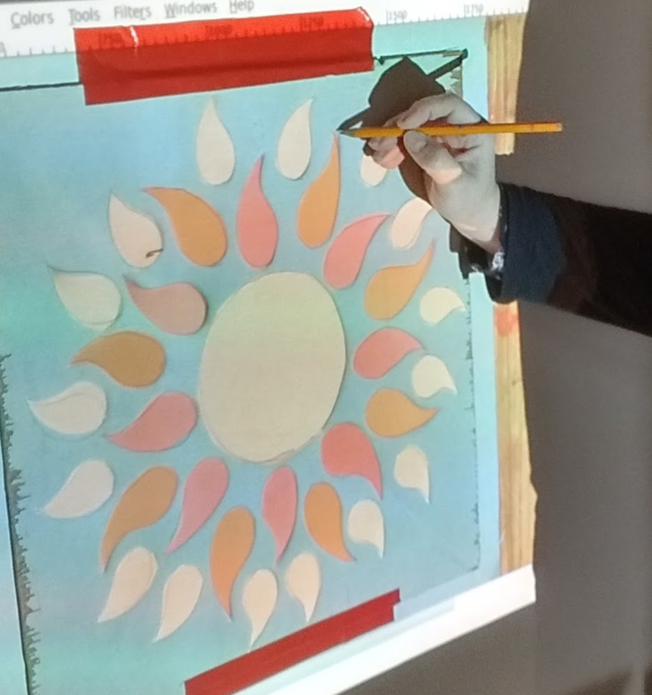
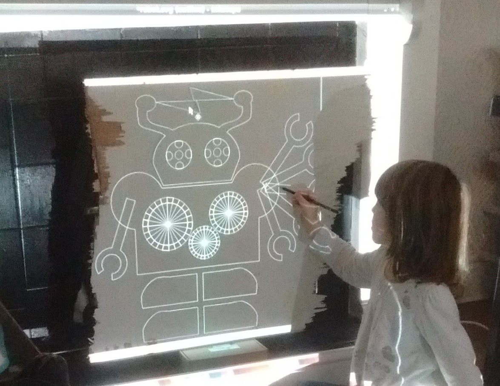
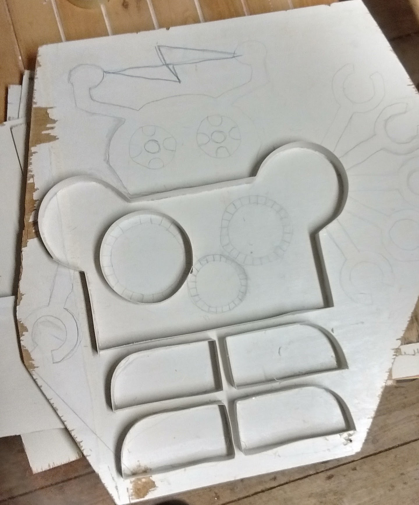
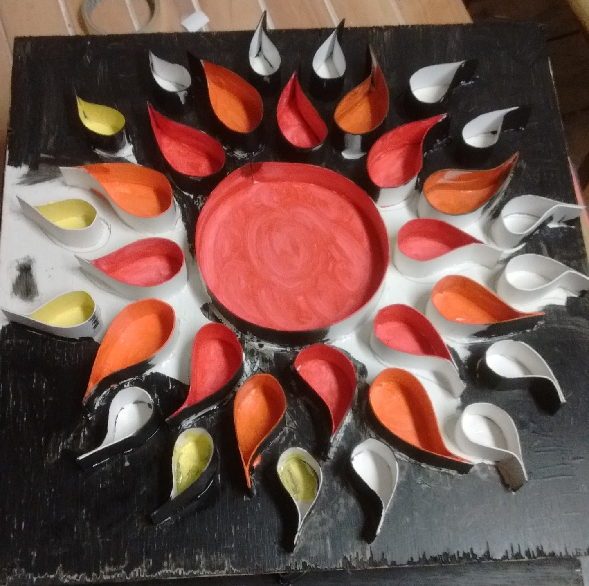
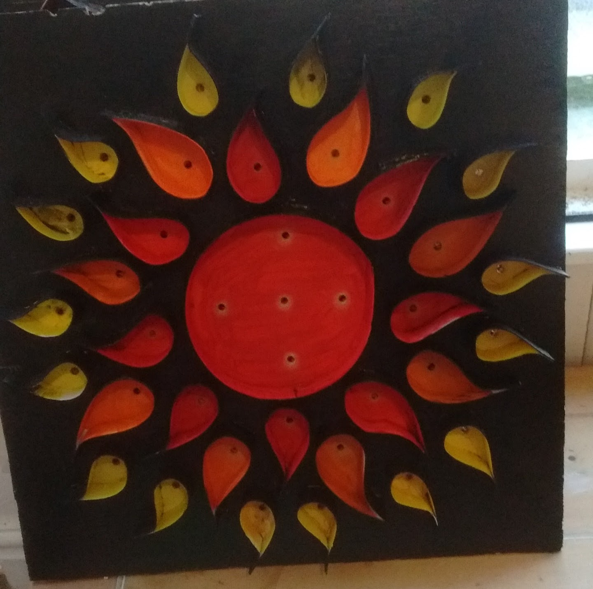
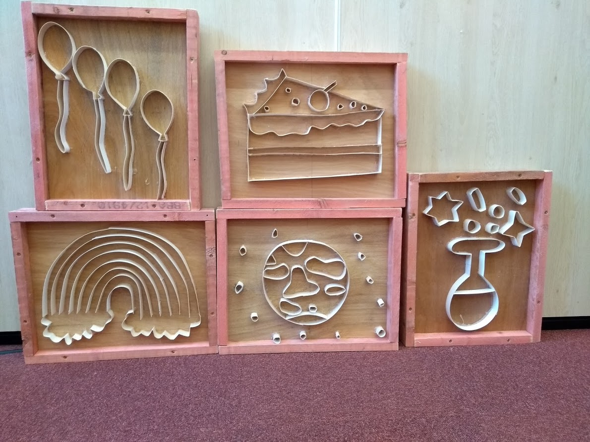

# Crafting

There is a [detailed worksheet](../worksheets/DesignYourGraphics.pdf) to help you design your vector art and sketch it to the board.

## Sketching

Painting the board with white primer before sketching can help with the finish. With vector art or a photograph, a digital projector can scale it to the right size for your board. Draw over the projected lines with a pencil, and block the projector occasionally to show lines which still need sketching.

## Baffling

Cut 20mm strips of thick card-stock for baffles and bend them to follow the sketched lines, hot-glueing them in place. This is most effective with a thin bead of glue on each side. A thin bead cools and cures more quickly than a thick glob. It also produces the neatest build.

## Painting

For the best finish and the easiest build process, paint each baffled section with an acrylic paint to match the intended light bulb colour.

Painted pieces look striking and effective day and night. However, at night the paint actually makes little difference as the baffle-separated sections are lit using different coloured bulbs and surrounded by darkness anyway.

## Drilling

Let the Acrylic paint dry fully before drilling as it makes a lot of dust. Globs of paint in the corners of the baffles should be spread thinly. If they remain wet until drilling the sawdust will permanently stick there, ruining the finish.

Ideally the holes made by the drill bit will be only just larger than the LEDs, so they are held in place easily when glueing. The exact drill diameter will depend on the material and LED sizes used. We standardised on 5mm straw hat LEDs for all our designs and a 5.5mm drill.

Wiring LEDs one by one is impossibly hard. When drilling, consider how holes within areas of the same colour can be filled with continuous chains of LEDs. Check the spacing of the LEDs in the chains you are using, and make sure the holes are not too far apart for them to reach. Any separate chains will each need their own connection to regulated power, which means more wiring work. In some cases we've saved effort by leaving a spare light at the back between two separated areas of the same colour, rather than unnecessarily splitting and splicing two chains. 

Take the visual effect into account when thinking where to drill the holes. The leds will act as bright point of coloured light to the viewer. Each bulb will cast a light radially from that point to illuminate the board. Walls will cast shadows if bulbs are not evenly distributed. Fewer well-placed LEDs can often look better.

Drill 'freehand' with a cordless drill from the front of the design. It's not necessary to mark in advance. Use LEDs sparingly aiming at no more than 50 per design, a max current of around 1 amps total. 

## Inserting

Provided sets of battery-powered LED chains in every colour from which makers can crop the number needed. They will populate the drilled holes in each area with the correct colour LED chains and test-light the piece. Insert the furthest light from the battery first. When all the holes of that colour are filled, you can crop the chain leaving the LEDs in place. 

Cropping them should leave two wires suitable for later stripping and crimping. Cut the chains exactly between two LEDs, leaving a workable length of wire both sides. This makes sure that inserted chains can be wired from the most convenient end and that leftover chain also has enough wire to splice. 

Sometimes there's not enough bulbs in one chain to complete a piece. Using up every chain fully first before starting on a new chain ensures chains are used evenly.

## Glueing

To fix LEDs permanently in place we use hot glue.

The 'straw-hat' reflector LEDs should protrude 5-10mm so the light shining out sideways from their barrel can illuminate the coloured areas of the illumination. Placing them flush with the board creates dots of light without lighting the painted areas.

Push the head of the LED fully through, insert a blob of glue behind it and then pull it back a fraction to seat within the rapidly-hardening glue. Hold it in position for a few seconds and it will be permanently fixed.

You can use the tip of a hot-glue gun from behind to loosen lights which have been badly inserted. A heat gun can be used to melt and re-position glue, but will melt the LED itself if applied without care - hot glue is used in the manufacture of the bulb housings of LED chains too

## Finessing the Build

Recently, we have made builds much more manageable by building standard-size frames from drilled, screwed and sanded coarse roof-battening.

This build protects the card baffles as well as the wires and circuitry at the back. It makes it much easier to store and transport the illuminations without damage.

# Next

Once the LEDs are glued we can move on to the [next steps - wiring them](./wiring.md).
