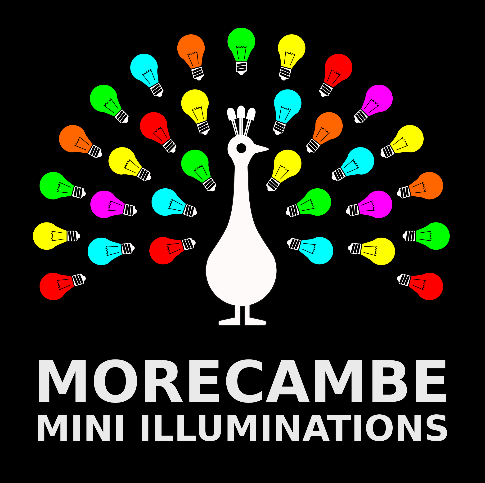
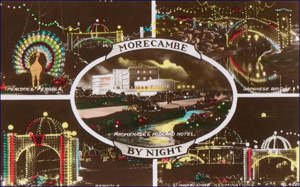

# Morecambe Mini Illuminations

Morecambe has a long history as a holiday-goers destination. In the winter months this used to mean _illuminations_. The old illuminations shown along the Morecambe Promenade can still be seen in antique postcards.

---

We decided to restart this long-standing tradition, but with _Mini_ Illuminations, made by community members using modern low-voltage electronic lights and small microcontrollers for animation.

This repository has a summary of the standard approach to constructing and deploying our mini-illuminations which we have developed over 3 years of shows and more than 60 different illuminations since November 2016.

# Build stages

We have separated instructions into three sequential stages:

- **Crafting** - shaping, painting and adding LED chains to the tableau
- **Wiring** - connecting the chains of LEDs to a static or animated circuit
- **Powering** - rigging up multiple illuminations to a shared low-voltage power supply.

Each stage is summarised below with links provided to detailed instructions.

## 1) Crafting

First, during [crafting](build/crafting.md) the tableau is designed as vector art and sketched on a board. The baffles between coloured areas are cut and glued. Each area and its baffle-sides are painted to the colours of the design. Holes are drilled for the insertion of bulbs. Chains of LEDs with matching colours are hot-glued in place to fill each coloured area, with trailing wire strands left unconnected.

See the [detailed crafting steps](build/crafting.md).

## 2) Wiring

Second, during [wiring](build/wiring.md) the trailing wires from hot-glued LEDs are connected back to one of three supporting circuits...

1. A **static** circuit- a fixed voltage permanently lighting all the coloured chains of a tableau
2. An **animated** circuit - a microcontroller switches a fixed voltage to coloured chains in a programmed sequence
3. An **addressable** circuit - a microcontroller sends messages to a fully-colour-controllable chain of LEDs.

Once the circuit is complete, a fused pair of wires is attached to the circuit and crimped to two 6.3mm Male spade connectors for later connection to a 5V DC supply.

See the [detailed wiring steps](build/wiring.md).

## 3) Powering

Finally, during [powering](build/powering.md) a suitable configuration of transformers and DC cabling is laid out to deliver the required 5V to every art piece.

See the [detailed crafting steps](build/crafting.md).

# About the Approach

The build process is designed to be accessible. Materials and techniques are within the reach of community members in educational and informal settings. The table below contrasts the historical illuminations build with the 'Mini' process we have selected.

| Feature   | Original     | Mini                         | Explanation                                                     |
| --------- | ------------ | ---------------------------- | --------------------------------------------------------------- |
| Bulbs     | Incandescent | LED                          | Bulbs available cheaply pre-wired on a reel, cool to the touch. |
| Material  | Metal        | Plywood, Card, Acrylic paint | Familiar craft materials, easy to work and repair               |
| Voltage   | 240V AC      | 5V DC                        | Low voltage circuit wiring without risk. 5V safe in the rain.   |
| Joints    | Soldering    | Crimping                     | Unskilled, low temperature crimping with hand tools.            |
| Structure | Welding      | Hot glue                     | Minimal hazard, easy to rework with a heat gun                  |
| Control   | PLController | Micropython                  | Learner programming language commonly used in schools           |
